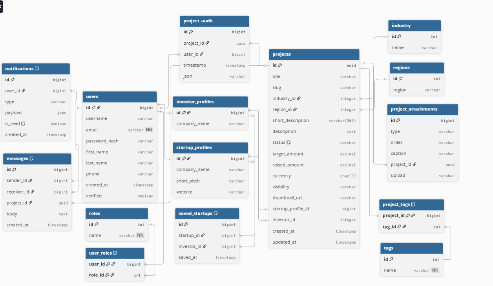

# UA-4421


UA-4421Project-based learning Full Stack Python/React

**Project Vision Statement:**

_"Empowering Innovation: Bridging Startups and Investors for Ukraine's Economic Growth"_

**Overview:**

In the dynamic world of entrepreneurship, the path from a transformative idea to a successful venture is often complex and challenging. Our WebAPI application, developed using the Django Rest Framework, is designed to be a cornerstone in simplifying this journey. We aim to create a robust and secure digital platform that caters to two pivotal groups in the business ecosystem: innovative startups with compelling ideas and forward-thinking investors seeking valuable opportunities.

**Goals:**

1. **Fostering Collaborative Opportunities:** Our platform bridges startups and investors, enabling startups to showcase their groundbreaking proposals and investors to discover and engage with high-potential ventures.

2. **Seamless User Experience:** We prioritize intuitive navigation and interaction, ensuring that startups and investors can easily connect, communicate, and collaborate.

3. **Secure and Trustworthy Environment:** Security is at the forefront of our development, ensuring the confidentiality and integrity of all shared information and communications.

4. **Supporting Economic Growth:** By aligning startups with the right investors, our platform not only cultivates individual business success but also contributes significantly to the growth and diversification of Ukraine's economy.

**Commitment:**

We are committed to delivering a platform that is not just a marketplace for ideas and investments but a thriving community that nurtures innovation fosters economic development, and supports the aspirations of entrepreneurs and investors alike. Our vision is to see a world where every transformative idea has the opportunity to flourish and where investors can confidently fuel the engines of progress and innovation.


## Registration anti-enumeration policy

The registration endpoint (`POST /api/auth/register/`) always returns `201` with a generic success message.
If the email already exists and the user is already verified, the backend performs no side effects.
If the email exists but is not yet verified, the backend may re-send the verification email.

### Password Reset Flow

The password reset endpoint (`POST /api/auth/password-reset/`) implements a secure password reset mechanism with anti-enumeration protection.

#### Endpoint

**POST** `/api/auth/password-reset/`

**Request Body:**
```json
{
  "email": "user@example.com"
}
```

**Response:** Always `200 OK`
```json
{
  "detail": "If the email exists, you will receive reset instructions."
}
```

#### Security Features

✅ **Anti-Enumeration Protection**
- Always returns `200 OK` regardless of whether email exists
- Same response message for existing and non-existing emails
- Prevents attackers from discovering valid email addresses

✅ **Rate Limiting**
- **IP-based:** 5 requests per hour per IP address
- **Email-based:** 3 requests per hour per email address
- Returns `429 Too Many Requests` when limits exceeded

✅ **Token Security**
- Cryptographically secure tokens using Django's `PasswordResetTokenGenerator`
- Tokens expire after 1 hour (configurable via `PASSWORD_RESET_TIMEOUT`)
- One-time use tokens
- Only active, verified users receive reset emails

✅ **Audit Logging**
- All password reset attempts logged to `PasswordResetAttempt` model
- Tracks: user, email, IP address, token sent status, timestamp
- Enables security monitoring and abuse detection

#### Email Template

When a valid user requests a password reset, they receive an email containing:

**Subject:** `Password Reset Request - Startup Gateway`

**Reset Link Format:**
```
{protocol}://{domain}/reset-password?uid={uid}&token={token}

Example:
https://startup-gateway.com/reset-password?uid=MQ&token=c7g8h9-abc123def456
```

**Link Parameters:**
- `uid` - Base64-encoded user ID
- `token` - Secure, time-limited reset token (valid for 1 hour)

**Email Templates Location:**
- Plain text: `templates/emails/password_reset.txt`
- HTML: `templates/emails/password_reset.html`

#### Configuration

**Settings (settings.py):**
```python
# Password reset token expiry (in seconds)
PASSWORD_RESET_TIMEOUT = 3600  # 1 hour

# Email configuration
DEFAULT_FROM_EMAIL = 'no-reply@startup-gateway.com'
SITE_NAME = 'Startup Gateway'
FRONTEND_URL = 'http://localhost:3000'

# Throttling
REST_FRAMEWORK = {
    'DEFAULT_THROTTLE_RATES': {
        'password_reset': '5/hour',
    }
}
```

#### Testing

Run password reset tests:
```bash
python manage.py test users.tests.TestPasswordResetApi -v 2
```

**Test Coverage:**
- Email sent for known, active users
- No email for unknown users
- No email for inactive users
- Email normalization (lowercase)
- Rate limiting (IP and email)
- Audit logging with IP tracking
- Token generation and validation
- Anti-enumeration verification
- Email content validation

#### API Usage Example
```bash
# Request password reset
curl -X POST http://localhost:8000/api/auth/password-reset/ \
  -H "Content-Type: application/json" \
  -d '{"email": "user@example.com"}'

# Response
{
  "detail": "If the email exists, you will receive reset instructions."
}
```

#### Database Schema

**PasswordResetAttempt Model:**
```python
class PasswordResetAttempt(models.Model):
    user = models.ForeignKey(User, null=True, blank=True)
    email = models.EmailField(db_index=True)
    ip_address = models.GenericIPAddressField()
    token_sent = models.BooleanField(default=False)
    created_at = models.DateTimeField(auto_now_add=True, db_index=True)
```

#### Implementation Notes

The password reset flow consists of two steps:

1. **Request** (implemented) - User requests reset via email, receives link
2. **Confirm** (to be implemented) - User submits new password with uid/token from email

This endpoint implements step 1. The confirm endpoint will validate the uid/token and allow the user to set a new password.

---

### Basic Epics

0. **As a user of the platform**, I want the ability to represent both as a startup and as an investor company, so that I can engage in the platform's ecosystem from both perspectives using a single account.
   - Features:
     - implement the functionality for users to select and switch roles.

1. **As a startup company,** I want to create a profile on the platform, so that I can present my ideas and proposals to potential investors.
   - Features:
     - user registration functionality for startups.
     - profile setup page where startups can add details about their company and ideas.

2. **As an investor,** I want to view profiles of startups, so that I can find promising ideas to invest in.
   - Features:
     - feature for investors to browse and filter startup profiles.
     - viewing functionality for detailed startup profiles.

3. **As a startup company,** I want to update my project information, so that I can keep potential investors informed about our progress and milestones.
   - Features:
     - functionality for startups to edit and update their project information.
     - system to notify investors about updates to startups they are following.

4. **As an investor,** I want to be able to contact startups directly through the platform, so that I can discuss investment opportunities.
   - Features:
     - secure messaging system within the platform for communication between startups and investors.
     - privacy and security measures to protect the communication.

5. **As a startup company,** I want to receive notifications about interested investors, so that I can engage with them promptly.
   - Features:
     - notification functionality for startups when an investor shows interest or contacts them.
     - dashboard for startups to view and manage investor interactions.

6. **As an investor,** I want to save and track startups that interest me, so that I can manage my investment opportunities effectively.
   - Features:
     - feature for investors to save and track startups.
     - dashboard for investors to manage their saved startups and investment activities.

### Additional Features

- **Security and Data Protection**: Ensure that user data, especially sensitive financial information, is securely handled.
- **User Feedback System**: Create a system for users to provide feedback on the platform, contributing to continuous improvement.
- **Analytical Tools**: Implement analytical tools for startups to understand investor engagement and for investors to analyze startup potential.

### Agile Considerations

- Each user story can be broken down into smaller tasks and developed in sprints.
- Regular feedback from both user groups (startups and investors) should be incorporated.

### Database Schema



## Automation & Quality

### Code Coverage
Project uses Codecov for coverage reporting.
To enable coverage upload:
1. Create `CODECOV_TOKEN` in GitHub Secrets
2. Run CI pipeline

### Dependabot
Dependabot is enabled for:
- GitHub Actions
- Python (pip)
- Frontend dependencies (npm)

**Step 1: Installation**

**Action**: Install pylint and pylint-django via pip. Pylint-django is a Pylint plugin that understands Django's structure and provides relevant linting.

**Command:**

pip install pylint pylint-django

**Step 2: Running the linter**

**Action**: To check your code with Pylint, run the following command from the project root

**Command:**

pylint --load-plugins pylint_django backend/

Replace backend/ with the name of your Django project folder if it differs.

**GitHub Actions**

Pylint is also run automatically on each push or pull request to the developer branch using GitHub Actions.
You can find the configuration in .github/workflows/pylint.yml.

**Local Development with Docker**

This project provides a containerized environment for consistent development across machines using Docker.

---

## Prerequisites

- [Docker](https://www.docker.com/get-started) installed and running
- [Docker Compose](https://docs.docker.com/compose/install/) installed

## Environment Variables

1. **Create your local `.env.docker` file** from the example:

```bash
cd startup_gateway
cp env.example .env.docker
```

2. **Edit .env.docker and fill in your real values.**
   .env.docker must not be committed to Git. It is included in .gitignore.
   env.example is safe to commit and serves as a template for your team.

## Running the Project

1. Build and start all services

docker-compose up --build -d

This will start:
backend (Django)
frontend (React in dev mode)
db (Postgres)
redis (optional, for channels/notifications)

2. Create Django superuser

docker-compose exec backend python manage.py createsuperuser

Follow the prompts to set username, email, and password.

This superuser can log into the admin panel at http://localhost:8000/admin.

3. Stopping the Containers

To stop and remove containers:

docker-compose down
